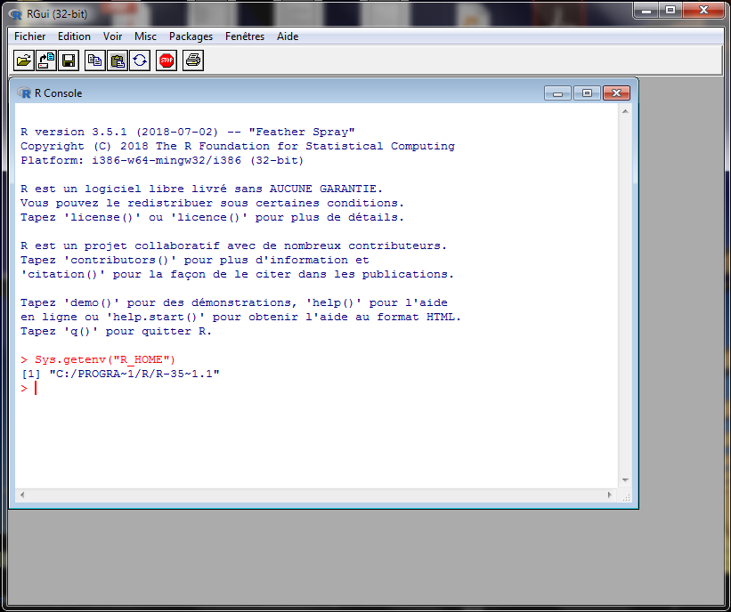
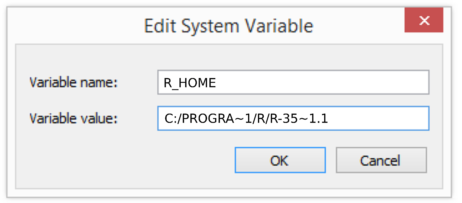

# Set the R_HOME Variable 

### To set the R_HOME variable via the Windows interface:

1.  Locate your R installation directory

    Open R (navigate through Program Files) and  type in `Sys.getenv("R_HOME")`
    
    Copy the path **without quotes** (ctrl C)



2. Do one of the following:
    
    **Windows 10** – Search for **Environment Variables** then select **Edit the system environment variables**

3. Click the **Environment Variables** button.
4. Under **System Variables**, click **New**.
5. In the **Variable Name** field, enter **R_HOME**
6. In the **Variable Value** field, paste your R_HOME installation path (ctrl V).



Note for Windows users on 64-bit systems
```
Progra~1 = 'Program Files'
Progra~2 = 'Program Files(x86)'
```

7.     Click **OK** and **Apply Changes** as prompted

You'll need to close and re-open any command windows that were open before you made these changes, as there's no way to reload environment variables from an active command prompt. If the changes don't take effect after reopening the command window, restart Windows.

### To set the R_HOME variable via the command line:

If you would prefer to set the R_HOME variable via the command line:

1. Open Command Prompt (make sure you Run as administrator so you're able to add a system environment variable).

2. Set the value of the environment variable to your R installation path as follows:

```
setx -m R_HOME "C:\Progra~1\R\R-XX~x.x"
```
If the path contains spaces, use the shortened path name.

3. Restart Command Prompt to reload the environment variables then use the following command to check the it's been added correctly. 

```
echo %R_HOME%
```

You shall see the path to your R installation.

